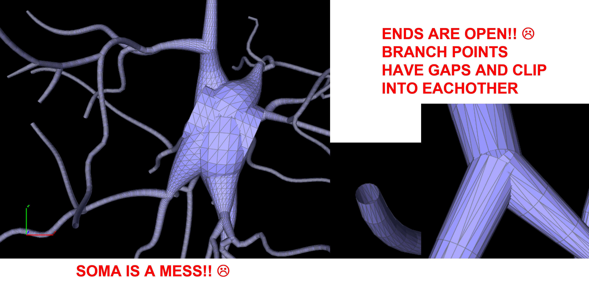
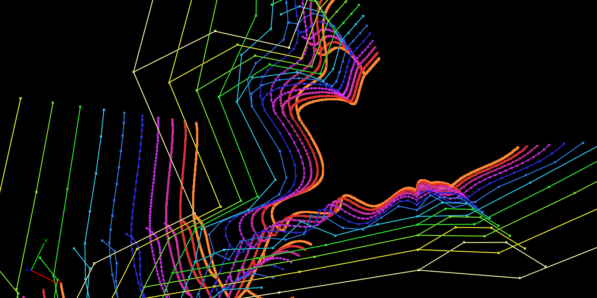
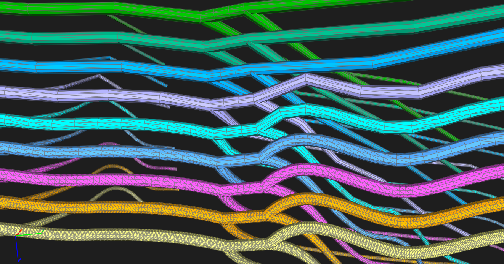
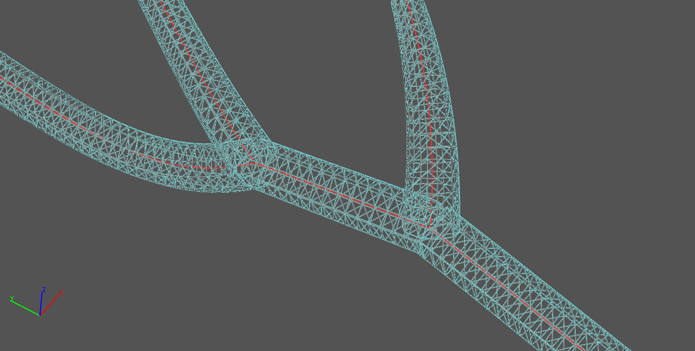
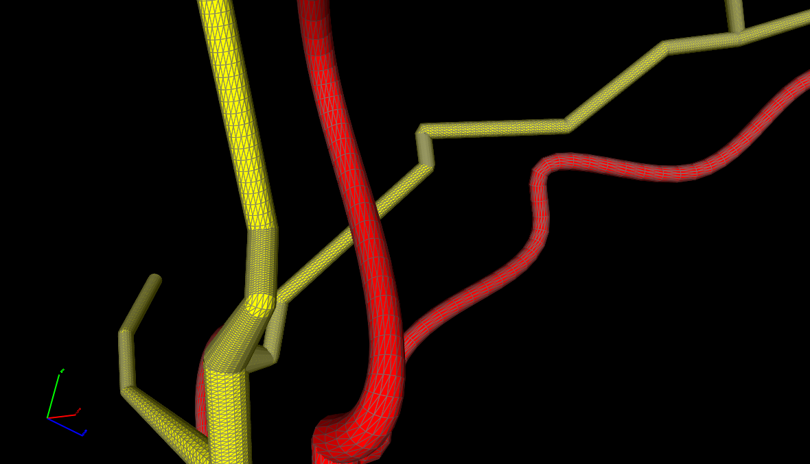
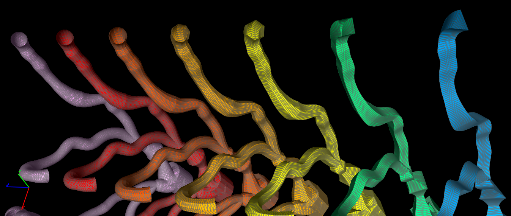
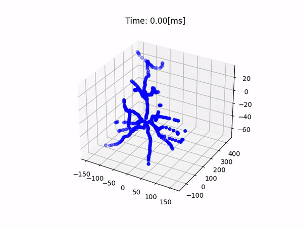

# PythonNeuronMeshes

Contents
========

 * [Tasks!](#tasks)
 * [What?](#what)
 * [Installation](#installation)
 * [Project Contents](#projectcontents)
 * [Usage](#usage)
 * [Other](#other)

### Tasks!
Here is a lists of tasks that need to be completed and questions that need to be answered

+ ~~Generate surface triangulations that are saveed to `.ugx` format. DONE!~~:white_check_mark:
+ ~~Check orientation of surface triangulations i.e. check normals. DONE!~~ :white_check_mark:
+ ~~Fixed the "bad element" message in Promesh4, issue was too many indexes for edges/faces. DONE!~~ :white_check_mark:
+ I have executed the code on the commandline through WSL --> can this be done using Powershell or Gitbash? this would be nice to write up directions :grey_question:
+ ADD MAPPING TO .UGX FILE --> TODO!:collision:
+ TURN 1D .SWC TO .UGX (MAKE SURE INDEXING MATCHED .UGX SURFACE MAPPING) --> TODO!:collision:
+ IMPORTANT: RESOLVE SOMA!! --> use a ball?? see [`paper`](https://github.com/jarosado0911/PythonNeuronMeshes/blob/main/papers/MeshQualityOriented3DGeometricVascularModelingBasedOnParallelTransport.pdf) :exclamation:
+ IMPORTANT: RESOLVE BRANCH POINTS!! :x:(see fig below)
+ CLOSE THE END OF THE DENDRITES!!  :x: (see fig below)
+ ~~Fix subset assignment in `.ugx` right now when you open the `.ugx` nothing appears because you have to manually select all and assign the subset DONE!~~:white_check_mark:
+ ~~Add jupyter-notebooks for more exploration of code.DONE!~~:white_check_mark:
<p align="center">
  
</p>

+ Question: I am using Pythons `scipy` module to realize the spline interpolation --> this needs to be studied further, what is the math used? a write up of how it is doing this would be nice :grey_question:
+ Remove soma line segment that is present in original `.swc` file from [`NeuroMorpho.org`](https://neuromorpho.org/):grey_question:
 
### What?
This project takes a `.swc` file downloaded from [`NeuroMorpho.org`](https://neuromorpho.org/) and generates:

+ 1D geometry refinements in .swc format
+ 3D surface mesh geometries in .ugx format, I used the strategy described here: [`Framing Parametric Curves`](https://janakiev.com/blog/framing-parametric-curves/)

The code allows the user to use spline interpolation for regularizing/refining the geometry or the user can produce refinements on the original `.swc` file. Below is a figure showing refinments generated using spline interpolation from Python's module `scipy`, details on the specific function are found here: [`scipy.interpolate`](https://docs.scipy.org/doc/scipy/reference/generated/scipy.interpolate.splprep.html).
<p align="center">
  
</p>

The project uses [`Parallel Transport Frames`](https://legacy.cs.indiana.edu/ftp/techreports/TR425.pdf) to generate the contours used in the mesh generation. Below is a figure showing some meshes with increasing refinements. Wikipedia on [`parallel tranpsport`](https://en.wikipedia.org/wiki/Parallel_transport). 
<p align="center">
  
</p>
Below is a figure showing the 1d geometry centered within the 3d surface mesh geometry (triangular faces hidden).
<p align="center">
  
</p>

### Installation
The project uses Python in particular I provide some version information that is currently used.
I recommend using Jupyter-Notebooks and downloading [`Promesh4`](https://promesh3d.com/) for view the geometries.
Other than that there is nothing else to install.
```
Python version:  3.8.10 (default, Mar 13 2023, 10:26:41)
[GCC 9.4.0]
Version info:    sys.version_info(major=3, minor=8, micro=10, releaselevel='final', serial=0)
Argparse:        1.1
networkx:   3.1
scipy:      1.10.1
numpy:      1.24.3
maplotlib:  3.7.1
```
This code was developed on a Windows Machine using Windows Subsystem for Linux (WSL) below are the computer specs:
```
Host Name:                 DESKTOP-R1UGLGT
OS Name:                   Microsoft Windows 11 Home
OS Version:                10.0.22621 N/A Build 22621
OS Manufacturer:           Microsoft Corporation
OS Configuration:          Standalone Workstation
OS Build Type:             Multiprocessor Free
System Manufacturer:       Alienware
System Model:              Alienware m15 R4
System Type:               x64-based PC
Processor(s):              1 Processor(s) Installed.
                           [01]: Intel64 Family 6 Model 165 Stepping 2 GenuineIntel ~2208 Mhz
BIOS Version:              Alienware 1.17.0, 3/14/2023
Windows Directory:         C:\WINDOWS
System Directory:          C:\WINDOWS\system32
Boot Device:               \Device\HarddiskVolume1
System Locale:             en-us;English (United States)
Input Locale:              en-us;English (United States)
```
Here is WSL information
```
 NAME      STATE           VERSION
* Ubuntu    Running         2

Welcome to Ubuntu 20.04.2 LTS (GNU/Linux 5.4.72-microsoft-standard-WSL2 x86_64)
```
If you are using Windows, then look here for a training module on WSL: [`Module-WSL`](https://learn.microsoft.com/en-us/training/modules/wsl-introduction/)

I also use [`Jupyter Notebooks`](https://jupyter.org/) when developing the code, I found it easy to work with and maneuver through the codes. In `wsl` I called 
```
jupyter-notebook --allow-root --no-browser
```
and then select one of the links to copy and paste into a browser (Chrome worked for me).
### Project Contents
When you git clone or download this project you should have the following items:
+ Folder `cells` contains some [`NeuroMorpho.org`](https://neuromorpho.org/) cells in `.swc` format
+ Folder `papers` contains some papers in `.pdf` format that are good references for proceeding in the project
+ Folder `src` is the course code, it only contains two `.py` files which are the main codes for the mesh and geometry generation
+ File `generate_meshes.py` is the main driver code which is described in the Usage section.

### Usage
This usage example was done on `wsl`, it 'should' work on Linux terminal as well (pending you have all the correct version of python and modules). I will try to include directions for PowerShell and GitBash.

There is a file called `generate_meshes.py` if you execute in the commandline `python3 generate_mesh.py` you will receive the following output
```
usage: generate_meshes.py [-h] -n NUMREFINE -c NUMCONTPTS -i INPUT -o OUTPUT [--spline]
generate_meshes.py: error: the following arguments are required: -n/--numrefine, -c/--numcontpts, -i/--input, -o/--output
```
If you execute `python3 generate_meshes.py -h` you will get some more help information:
```
usage: generate_meshes.py [-h] -n NUMREFINE -c NUMCONTPTS -i INPUT -o OUTPUT [--spline]

This program will generate .swc refinements, usage: python3 generate_mesh.py -n 4 -c 6 -i cells/<cellname> -o
<outfoldername> --spline

optional arguments:
  -h, --help            show this help message and exit
  -n NUMREFINE, --numrefine NUMREFINE
                        Number of Refinements
  -c NUMCONTPTS, --numcontpts NUMCONTPTS
                        Number of Contour points
  -i INPUT, --input INPUT
                        The input .swc file
  -o OUTPUT, --output OUTPUT
                        The output folder name
  --spline              Use splines
```
The folder `cells` contains cells which were downloaded from [`NeuroMorpho.org`](https://neuromorpho.org/)
Example usage using splines is shown below
```
python3 generate_meshes.py -n 12 -c 18 -i cells/272-1-6-CD.CNG.swc -o output_mesh --spline
```
This will produce an output folder called `output_mesh` and it will contain `.swc` files and `.ugx` files which are numbered accordingly. The output below will be printed below:
```
Number of refinements:     12
Number of contour points:  18
Input file:                cells/272-1-6-CD.CNG.swc
Output file:               output_mesh
DX =  [128, 64, 32, 16, 8, 4, 2, 1, 0.5, 0.25, 0.125, 0.0625]
refining round... 128  64  32  16  8  4  2  1  0.5  0.25  0.125  0.0625   Done!
```
If you leave off `--spline` then splines will not be used:
```
python3 generate_meshes.py -n 12 -c 18 -i cells/272-1-6-CD.CNG.swc -o output_mesh_nospline
```
The difference between generating meshes using splines and without splines is shown in the figure below. The yellow mesh is pure refinement of the original `.swc` by repeated splitting of the edges of the original geometry. The red mesh uses a spline with equally spaced sampled points. The spline is an interpolation of the original points along the trunk (a trunk is a piece of neuron between two adjacent branch points).
<p align="center">
  
</p>

The parameter `c` affects the type of regular polygon used for the contours, in the figure below the far left mesh uses 32-ngons for contours and the far right uses equilateral triangles (3-gons) for contours.
<p align="center">
  
</p>

### Other
- Here is a link to using parallel frame transport (PFT) with Unity: [`PFT`](https://giordi91.github.io/post/2018-31-07-parallel-transport/)
- Here is another website that discussed parallel frames: [`Mathematical Visualization SS 2013`](http://dgd.service.tu-berlin.de/wordpress/vismathss2013/2013/06/)
- Another interesting link: [`Tutorial 3: Framed Closed Curves`](http://wordpress.discretization.de/ddg2016/2016/05/10/tutorial-3-framed-closed-curves/)
- Video on PFT: [`TD Essentials: Parallel Transport`](https://www.youtube.com/watch?v=5LedteSEgOE)
- PFT on a torus: [`PFT Torus`](http://www.rdrop.com/~half/math/torus/parallel.transport.xhtml)
- Here is alink on spline interpolation for C#: [`C# Spline`](https://swharden.com/blog/2022-01-22-spline-interpolation/)
- Here is a video I made using Yale Neuron, there is a notebook in the `notebooks` folder where I do this:
<p align="center">
  
</p>
