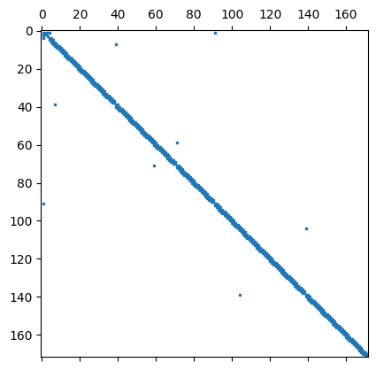

# Source Files

Contents
========

 * [Files](#files)
 * [Render Neuron](#renderneuron)
 * [Parallel Frame](#parallelframe)
 
 ### Files
 This is the source directory which contains the following two python files:
+ `renderneuron.py` contains the functions for making and saving simple refinements, and spline refinements. The file also contains some plotting features
+ `parallelframe.py` contains the functions which uses [`Parallel Transport Frames`](https://legacy.cs.indiana.edu/ftp/techreports/TR425.pdf) to generate contours along a path, and then connects the contours to make a mesh. There is a function for writing the `.ugx` file which contains the mesh with surface triangulations.

### Render Neuron
The `renderneuron.py` file contains the following functions:

- `spline_neuron(Gin,delta_x)` this function takes in a graph object `Gin`, and a delta_x. This function makes a spline using the original `.swc` points on the trunk for interpolation. Then new points are generated by approximately dividing the splined trunk into delta_x segments.
- `get_trunks(G)` this function takes in a graph object `Gin` and find the branch points and then collects the corresponding trunks that are between branch points. The function returns a dictionary `trunks` with keys that are the trunk number and the values are a list of node indices that are in the trunk (including the endpoints which are branch points). It also returns a graph object for each trunk.
- `refine_and_save(G,path,n=5)` this function takes in a graph object, a filename, and the number of refinements to make. The function generates simple refinements and saves them to a `.swc` file
- `save_to_swc(G,filename)` this function takes in a graph object `G` and a filename and saves the graph to a `.swc` file format to be visualized in [`Promesh4`](https://promesh3d.com/)
- `read_swc(filename)` This function takes in a filename (`.swc` file) and reads the lines of the file into a variable called lines. The lines are split accordingly. For reference below is an example of the `.swc` file specification:
```
1 1 0.0 0.0 0.0 9.65903 -1
2 1 2.91 -1.33 -0.26666666666666666 9.659030000000001 1
3 1 -2.9066666666666667 1.33 0.26666666666666666 9.659030000000001 1
4 3 5.413235451644908 8.564754898830946 -1.7700194690197044 5.904919712537043 1
...
```
- `plot_hines_sparsity(G)` This function make a sparsity matrix that describes the connectivity of the neuron graph. This function takes in a graph object (G) and uses the edges information to generate the sparsity matrix. Below is an example of a Hine sparsity pattern
<p align="center">
  
</p>

### Parallel Frame Transport